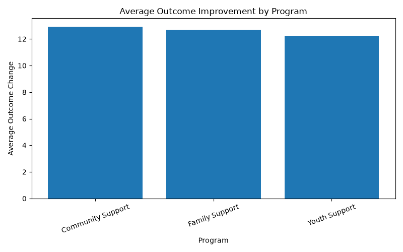
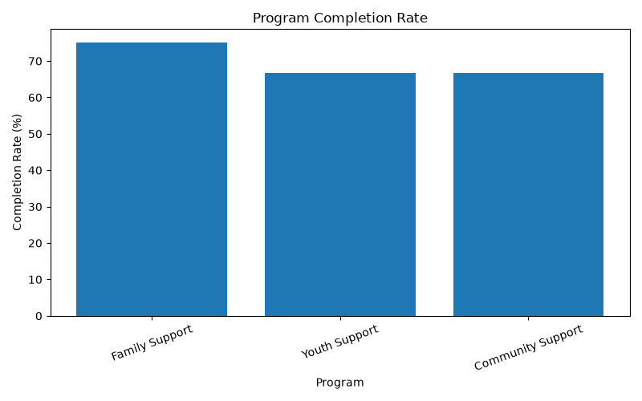
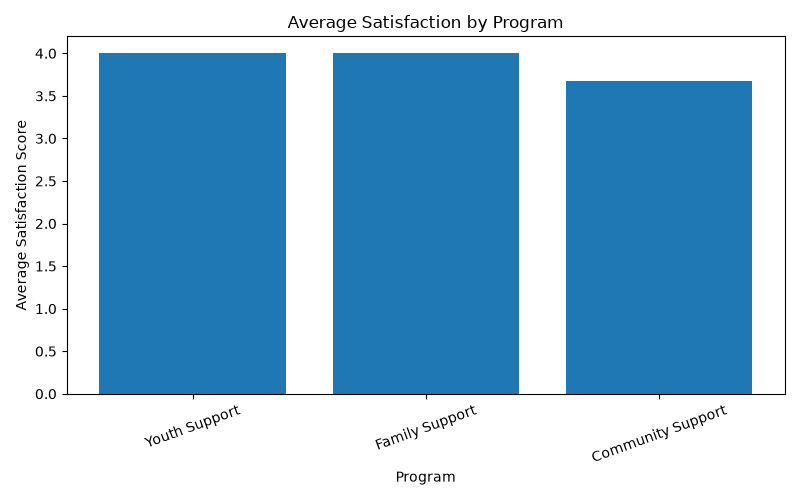
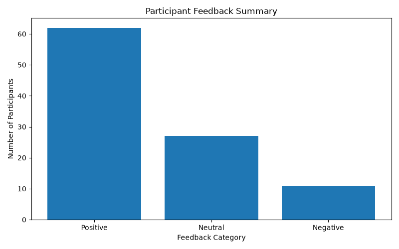

# Community Program Data & Evaluation Analysis

A portfolio project demonstrating data analysis, SQL, Python, Power BI, and reporting skills using simulated community program data.

The project follows a simple end-to-end analysis process, from generating and preparing data through to database analysis, visualisation, dashboard development, and management reporting.

> **Note:** All data used in this project is synthetic and was created for portfolio purposes. It does not contain or represent actual Department of Communities data.

## Project Objectives

The project aims to:

- analyse participant and program performance
- measure program completion, satisfaction, and changes in participant outcomes
- compare results across programs and reporting periods
- analyse program budget and expenditure
- identify patterns and areas that may need further review
- present results through charts, a Power BI dashboard, and management reporting

## Tools & Technologies

- **Python**
  - pandas
  - matplotlib
  - sqlite3
- **SQL**
- **SQLite**
- **Power BI**
  - Power Query
  - DAX
  - Data modelling
- **CSV / Excel**
- **Visual Studio Code**
- **Git & GitHub**

## Project Structure

```text
├── data/
│   ├── community_program.csv
│   ├── community_program_clean.csv
│   ├── program_financials.csv
│   └── program_financials_clean.csv
│
├── database/
│   └── community_program.db
│
├── output/
│   ├── average_outcome_improvement.png
│   ├── average_satisfaction.png
│   ├── feedback_summary.png
│   ├── program_completion_rate.png
│   └── management_report.csv
│
├── powerbi/
│   └── PowerBIVisualization.pbix
│
├── reports/
│    └── Community_Program_Performance_Report_2025.pdf
├── sql/
│   ├── create_tables.sql
│   └── analysis.sql
│
├── generate_data.py
├── main.py
└── README.md
```

## Analysis Workflow

### 1. Data Generation

`generate_data.py` creates synthetic participant and financial data for the project.

The participant dataset contains information such as program type, region, age group, reporting date, sessions attended, completion status, satisfaction score, participant outcomes, and feedback category.

A separate financial dataset contains quarterly program budgets, actual expenditure, and budget variance.

### 2. Data Cleaning and Validation

Python and pandas are used to prepare and check the data before analysis.

This includes:

- checking missing values
- checking duplicate records
- validating participant and financial data
- calculating outcome changes
- creating reporting year and quarter fields
- preparing cleaned datasets for analysis

### 3. Relational Database

The cleaned data is organised in a SQLite relational database.

Separate program, participant, and financial data are linked so that SQL queries can be used to analyse program performance and financial information without storing the same information unnecessarily.

### 4. SQL Analysis

SQL is used to join, filter, group, and summarise the data.

The analysis includes:

- participant numbers by program
- program completion rates
- average satisfaction
- average outcome improvement
- participant feedback
- program and regional comparisons
- program budgets and expenditure
- budget variance

### 5. Data Visualisation

Python and Matplotlib are used to create visual summaries of the analysis.

#### Average Outcome Improvement



#### Program Completion Rate



#### Average Satisfaction



#### Participant Feedback



### 6. Power BI Dashboard

The project was extended into Power BI to provide an interactive view of program performance and financial results.

Power Query is used to prepare the reporting data, with relationships created between participant, program, reporting period, and financial information.

DAX measures are used to calculate:

- total participants
- completed participants
- completion rate
- average satisfaction
- average outcome change
- total budget
- total expenditure
- budget variance
- budget utilisation

The dashboard allows results to be viewed by program and reporting quarter.

### 7. Management Reporting

The analysis is also summarised in a management reporting output.

The report focuses on key program and financial results, including completion rates, participant outcomes, satisfaction, budget performance, and areas that may need further review.

The results are descriptive and are not intended to establish that a program caused a particular participant outcome.

## Management Report

[View the Community Program Performance Report](reports/Community_Program_Performance_Report_2025.pdf)

## Example Results

Using the synthetic 2025 dataset:

- 100 participant records were analysed
- overall program completion was 79%
- average satisfaction was 3.15 out of 5
- average participant outcome improvement was 12.59
- total program budget was approximately $1.37 million
- total expenditure was approximately $1.34 million
- the overall budget variance was $28,874 favourable

These results are included only to demonstrate the analysis and reporting process.

## Skills Demonstrated

This project demonstrates practical experience in:

- Python and pandas
- SQL querying
- relational database design
- data cleaning and validation
- data analysis
- Power BI and Power Query
- DAX measures
- data visualisation
- performance and financial reporting
- identifying trends and differences in data
- communicating analytical results
- Git and version control

## Limitations

This project uses a small synthetic dataset created for demonstration purposes.

The analysis is descriptive and should not be interpreted as evidence of actual program effectiveness or participant outcomes. A real workplace analysis would require additional data validation, organisational context, stakeholder input, and further investigation before conclusions or decisions were made.

## Context

This is an independent portfolio project and is not affiliated with, commissioned by, or based on confidential data from the Western Australian Department of Communities.

The project was developed to demonstrate data analysis and reporting skills that may be useful in public-sector and community-service environments.